Introduction
============

Hydropower is an alternative form of renewable energy that has brought
clean power and jobs to various regions in the U.S. Renewable energy has
been a popular topic in politics and the race for independence from
fossil fuels and foreign fuel continues. There are over 191 Hydropower
facilities in the U.S as of 2011 and the maintenance and output of power
is dependent upon the area that the facility is erected and the wattage
that is created by the water source. The U.S Department of the Interior
Bureau of Reclamation released an executive summary of the hydropower
facilities in five different regions analyzing the cost to create and
the amount of power generated from each facility. Also included in the
public source data frame is a value called "Plant Factor" and multiple
"Green Incentive" headings. The plant factor is how the plant operates
at the installed capacity; therefore, a high Plant Factor score
indicates a more feasible site and high return rate. Financial
incentives, either from federal or local government for a company to use
clean energy are available for many facilities across the U.S, although
hydropower energy generation is not eligible in many government
programs. The analysis done included the incentives that were available
for the hydropower plant installation and cost of business. The benefit
cost ratio is another parameter to take into account to measure the
efficiency of a Hydropower plant. This ratio compares the present value
of benefits in place of the 2010 analysis to the current value of costs.
A Benefit cost ratio of 1.0 or greater shows the benefits exceed the
costs necessary for the project.

Inital Set Up
=============

I decided to look at the Green incentives within the Cost Benefit Ratio
and the Internal Rate of Return and see if they had any correlation with
the plant factor in each region.

    library(knitr)
    library(tidyr)
    library(dplyr)

    ## 
    ## Attaching package: 'dplyr'

    ## The following objects are masked from 'package:stats':
    ## 
    ##     filter, lag

    ## The following objects are masked from 'package:base':
    ## 
    ##     intersect, setdiff, setequal, union

    library(ggplot2)
    library(reshape2)

    ## 
    ## Attaching package: 'reshape2'

    ## The following object is masked from 'package:tidyr':
    ## 
    ##     smiths

    library(readr)
    ResourceAssessmentSummaryData032011 <- read_csv("~/Documents/Spring2017GRAD/GEOL590/FinalProject/Hydropower/ResourceAssessmentSummaryData032011.csv")

    ## Parsed with column specification:
    ## cols(
    ##   Region = col_character(),
    ##   `Resource Assessment Site ID` = col_character(),
    ##   `Site Name/Facility` = col_character(),
    ##   `Design Head (feet)` = col_number(),
    ##   `Design Flow (cfs)` = col_number(),
    ##   `Installed Capacity (kW)` = col_number(),
    ##   `Annual Production (MWh)` = col_number(),
    ##   `Plant Factor` = col_double(),
    ##   `Total Construction Cost (1,000 $)` = col_character(),
    ##   `Annual O&M Cost (1,000 $)` = col_character(),
    ##   `Cost per Installed Capacity ($/kW)` = col_character(),
    ##   `Benefit Cost Ratio with Green Incentives` = col_double(),
    ##   `IRR with Green Incentives` = col_character(),
    ##   `Benefit Cost Ratio without Green Incentives` = col_double(),
    ##   `IRR without Green Incentives` = col_character()
    ## )

    #View(ResourceAssessmentSummaryData032011)

    #This data has horrible column names
    thedata <- ResourceAssessmentSummaryData032011
    old.col.names <- colnames(thedata)
    new.col.names <- gsub("[^a-zA-Z0-9]", ".", old.col.names) #get rid of non-alphanumeric
    colnames(thedata)<-new.col.names #put new col names in the data frame

    #The $ in the values is going to be a problem... kill it.
    thedata$Total.Construction.Cost..1.000... <- as.numeric(gsub( "[\\$,]", "", 
                                                                  thedata$Total.Construction.Cost..1.000...))
                                                            
    thedata$Annual.O.M.Cost..1.000... <- as.numeric(gsub( "[\\$,]", "", 
                                                          thedata$Annual.O.M.Cost..1.000...))          
          
    thedata$Cost.per.Installed.Capacity....kW. <- as.numeric(gsub( "[\\$,]", "", 
                                                                   thedata$Cost.per.Installed.Capacity....kW.))
     
    thedata$IRR.with.Green.Incentives <- as.numeric(gsub( "[\\%><]", "", 
                                                          thedata$IRR.with.Green.Incentives))

    thedata$IRR.without.Green.Incentives <- as.numeric(gsub( "[\\%><]", "", thedata$IRR.without.Green.Incentives))

    #Now that everything is a numeric structure and doesn't include strange characters, we can analyze the data.
    #production efficiency, cost-production ratios, and eventually compare these values to energy 
    #consumption 

    #Region vs benefit cost w/o Green Incentive.
    regions <- thedata %>%
      group_by(Region)%>%
      ggplot(aes(x=Region, y=Benefit.Cost.Ratio.without.Green.Incentives)) +
      geom_boxplot() +
      labs( y= "Cost Benefits", title = "Regional Cost Benefits without Green Incentive")

    print(regions)

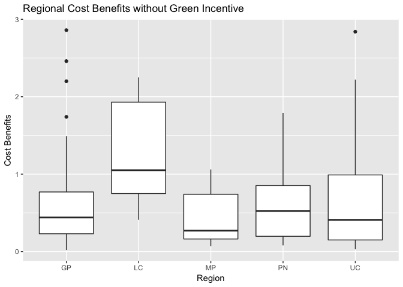

Great Plains: Diverse Region
----------------------------

I chose to look further into the regions because I wanted to see how the
green incentive compares between each of these diverse regions. After
reading more into the Hydropower analysis done by U.S Energy Information
Administration, I saw that they did some comparisons with the green
incentive in the regions as well as the IRR.

    mean.green.incentive <- mean(thedata$Benefit.Cost.Ratio.with.Green.Incentives)
    mean.no.green.incentive <- mean(thedata$Benefit.Cost.Ratio.without.Green.Incentives)

    #Benefit cost ratio between Green incentive and no Green incentive

    total.difference <- mean.green.incentive - mean.no.green.incentive

    #### The Green incentive difference between all regions increase the benefit cost ratio by .076

    ##Individual regions for later use.

    greatplains_data <- thedata[1:73 , ]
    lowercolorado_data <-thedata[74:78, ]
    midpacific_data <- thedata[79:92, ]
    pacificnw_data <- thedata[93:126, ]
    upcolorado_data <- thedata[127:191, ]

    all_regions <- thedata %>%
      group_by(Region) %>%
      summarise(difference.incentive = (mean(Benefit.Cost.Ratio.with.Green.Incentives) - 
                                        mean(Benefit.Cost.Ratio.without.Green.Incentives)))

    p_all_regions <-  ggplot(all_regions, aes(x=Region, y=difference.incentive)) +
      geom_point() +
      labs(x= "Regions", y="Difference in Benefits between Green Incentive", title = "Regional difference between the Cost Benefits with and without a Green Incentive")

    p_all_regions

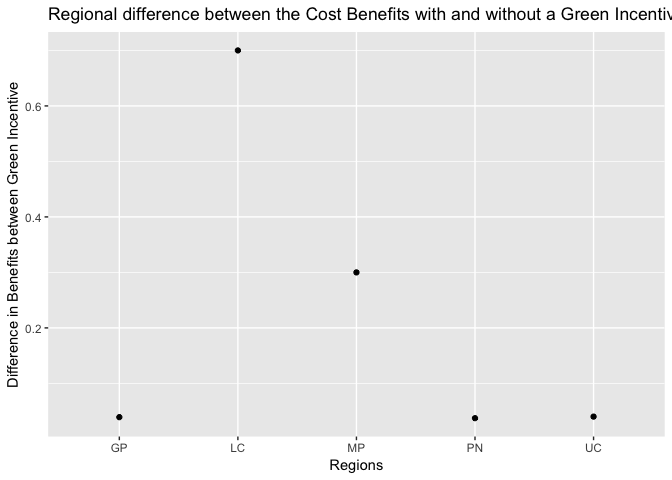
\#Region Breakdown The various differences in the data frames were
interesting ranges. I did subtract the Benefit cost ration without the
green incentive from the values that were attained with the green
incentive. To continue, I wanted to compare the different ranges in the
plant factor with the green incentive via the cost benefit and the
internal rate of return.

Great Plains Analysis
=====================

The Great Plains hydropower data is made up of 146 sites across the
entire states of North Dakota, South Dakota, Nebraska, Kansas, Oklahoma
and large portions of Texas, Colorado, Wyoming, and Montana. 72 are
included in this dataframe.

    #Want to compare the different ranges of Plant factors with the green incentive. 
    # A novel comparison.

    #Making tidy data
    gp <- c(8, 12, 14)
    tidy_greatplains_data <- greatplains_data[ , gp]

    tidy_greatplains <- gather(tidy_greatplains_data, -Plant.Factor, key=incentive_status, value=BCR)
    tidy_greatplains$incentives <- c("Benefit.Cost.Ratio.with.Green.Incentives"=TRUE, "Benefit.Cost.Ratio.without.Green.Incentives")[tidy_greatplains$incentive_status]

    tidy_greatplains$incentives[tidy_greatplains$incentive_status == "Benefit.Cost.Ratio.without.Green.Incentives"] <- FALSE
    tidy_greatplains$incentives[tidy_greatplains$incentive_status == "Benefit.Cost.Ratio.with.Green.Incentives"] <- TRUE

    tidy_greatplains <- melt(tidy_greatplains_data, id="Plant.Factor", variable.name="incentives", value.name="BCR")

    p_greatplains.tidy <- ggplot(tidy_greatplains, aes(x=Plant.Factor, y=BCR, color=incentives)) + 
      geom_point() +
      labs(x= "Plant Factor", y="Benefit Cost Ratio", title= "Great Plains Cost Benefits between Green Incentive")

    ##Graph of the plant factor with and without the green incentive. Want to compare the IRR with and without
    #the green incentive.

    r<- c(8, 13, 15)

    tidy_irr <- greatplains_data[ , r]

    tidy_irr_greatplains <- gather(tidy_irr, -Plant.Factor, value=IRR, key=incentive_status)
    tidy_irr_greatplains$incentives <- c("IRR.with.Green.Incentives"=TRUE, "IRR.without.Green.Incentives")[tidy_irr_greatplains$incentive_status]

    tidy_irr_greatplains$incentives[tidy_irr_greatplains$incentive_status == "IRR.without.Green.Incentives"] <- FALSE
    tidy_irr_greatplains$incentives[tidy_irr_greatplains$incentive_status == "IRR.with.Green.Incentives"] <- TRUE

    p_greatplains.irr <- ggplot(tidy_irr_greatplains, aes(x=Plant.Factor, y=IRR, color=incentives)) + 
      geom_point() +
      labs(x= "Plant Factor", y="IRR", title= "Great Plains Internal Rate of Return between Green Incentives")

    print(p_greatplains.irr)

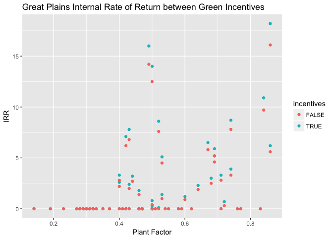

    print(p_greatplains.tidy)

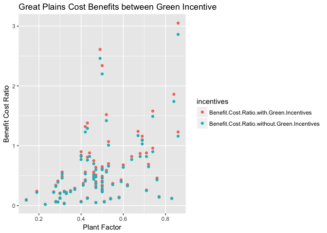
\#Great Plains Conclusion The two cost benefits from the Great Plains
region, which ranked the lowest on the Green Incentive graph previously
shown, shows a lot of zero internal rate of return throughout
multifarious plant factors. Although I did not read the entire final
executive summary done by the Department of the Interior Bureau of
Reclamation Power Resources Office, I would guess that this was one of
the locations that these locations were not eligible for the green
incentive assistance, making it a less plausible long-term investment.
Which I find interesting because the Benefit cost ratios without the
Green Incentive are all below 1.0. While there are some Green Incentive
data points above the 1.0 Benefit Cost Ratio, most are the same points
as the Ratio without the Green Incentive. I would hypothesize that this
region is not a highly government funded area and that the hydropower
plants are either dwindling in efficiency since being constructed.

Lower Colorado Analysis
=======================

The next area is the Lower Colorado area is made up of 30 sites, but
only five are included in the executive summary. It includes the state
of Arizona, and small portions or Nevada, Utah, and California that
outline Arizona.

    ################################################
    ##### Lower Colorado

      #CostBenefit with/without green incentive compared to the plant factor

    tidy_lc <- lowercolorado_data[ ,gp ]

    new_tidy_lc <- gather(tidy_lc, -Plant.Factor, key=incentive_status, value=BCR)
    new_tidy_lc$incentives <- c("Benefit.Cost.Ratio.with.Green.Incentives"=TRUE, "Benefit.Cost.Ratio.without.Green.Incentives")[new_tidy_lc$incentive_status]

    new_tidy_lc$incentives[new_tidy_lc$incentive_status == "Benefit.Cost.Ratio.without.Green.Incentives"] <- FALSE
    new_tidy_lc$incentives[new_tidy_lc$incentive_status == "Benefit.Cost.Ratio.with.Green.Incentives"] <- TRUE

    lc_plot <- ggplot(new_tidy_lc, aes(x=Plant.Factor, y=BCR, color=incentives)) + 
      geom_point() +
      labs(x= "Plant Factor", y="Benefit Cost Ratio", title = "Lower Colorado Benefit Cost Ratio between Green Incentives")

        ## IRR w & w/o green incentive

    r<- c(8, 13, 15)

    lc_irr <- greatplains_data[ , r]

    tidy_lc_irr <- gather(lc_irr, -Plant.Factor, value=IRR, key=incentive_status)
    tidy_lc_irr$incentives <- c("IRR.with.Green.Incentives"=TRUE, "IRR.without.Green.Incentives")[tidy_lc_irr$incentive_status]

    tidy_lc_irr$incentives[tidy_lc_irr$incentive_status == "IRR.without.Green.Incentives"] <- FALSE
    tidy_lc_irr$incentives[tidy_lc_irr$incentive_status == "IRR.with.Green.Incentives"] <- TRUE

    p_tidy_lc_irr <- ggplot(tidy_lc_irr, aes(x=Plant.Factor, y=IRR, color=incentives)) + 
      geom_point() +
      labs(x= "Plant Factor", y="IRR", title= "Lower Colorado Internal Rate of Return")

    print(p_tidy_lc_irr)

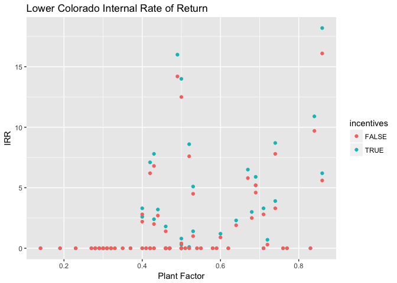

    print(lc_plot)

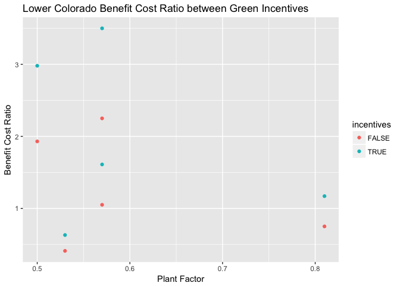
\#Lower Colorado Conclusion The Lower Colorado had the highest number
after the difference between the green incentive benefit and without the
green incentive. Overall the green benefits correlated with a higher
Benefit Cost Ratio in each of the included sites. The Internal rate of
return showed similar trends as the Great Plains data, except that there
were no zero IRR values for any of the Green Incentive data points.

Mid Pacific Northwest Analysis
==============================

The Mid Pacific Northwest region is made up of the majority of
California and Nevada and includes 11 sites in this study.

    ##### Mid- Pacific ##
    tidy_midpacific_data <- midpacific_data[ , gp]

    new_tidy_midpacific_data <- gather(tidy_midpacific_data, -Plant.Factor, key=incentive_status, value=BCR)
    new_tidy_midpacific_data$incentives <- c("Benefit.Cost.Ratio.with.Green.Incentives"=TRUE, "Benefit.Cost.Ratio.without.Green.Incentives")[new_tidy_midpacific_data$incentive_status]

    new_tidy_midpacific_data$incentives[new_tidy_midpacific_data$incentive_status == "Benefit.Cost.Ratio.without.Green.Incentives"] <- FALSE
    new_tidy_midpacific_data$incentives[new_tidy_midpacific_data$incentive_status == "Benefit.Cost.Ratio.with.Green.Incentives"] <- TRUE

    new_tidy_midpacific_data<- melt(tidy_midpacific_data, id="Plant.Factor", variable.name="incentives", value.name="BCR")

    p_new_tidy_midpacific_data <- ggplot(new_tidy_midpacific_data, aes(x=Plant.Factor, y=BCR, color=incentives)) + 
      geom_point() +
      labs(x= "Plant Factor", y="Benefit Cost Ratio", title = "MidPacific NW Cost Benefits with and without Green Incentive")

    ##Graph of the plant factor with and without the green incentive. Want to compare the IRR with and without
    #the green incentive.

    tidy_irr_midpacific <- midpacific_data[ , r]

    new_tidy_irr_midpacific <- gather(tidy_irr_midpacific, -Plant.Factor, value=IRR, key=incentive_status)
    new_tidy_irr_midpacific$incentives <- c("IRR.with.Green.Incentives"=TRUE, "IRR.without.Green.Incentives")[new_tidy_irr_midpacific$incentive_status]

    new_tidy_irr_midpacific$incentives[new_tidy_irr_midpacific$incentive_status == "IRR.without.Green.Incentives"] <- FALSE
    new_tidy_irr_midpacific$incentives[new_tidy_irr_midpacific$incentive_status == "IRR.with.Green.Incentives"] <- TRUE

    p_irr_midpacific <- ggplot(new_tidy_irr_midpacific, aes(x=Plant.Factor, y=IRR, color=incentives)) + 
      geom_point() +
      labs(x= "Plant Factor", y="Benefit Cost Ratio", title=" MidPacific NW Internal Rate of Return between the Green Insentive")

    print(p_irr_midpacific)

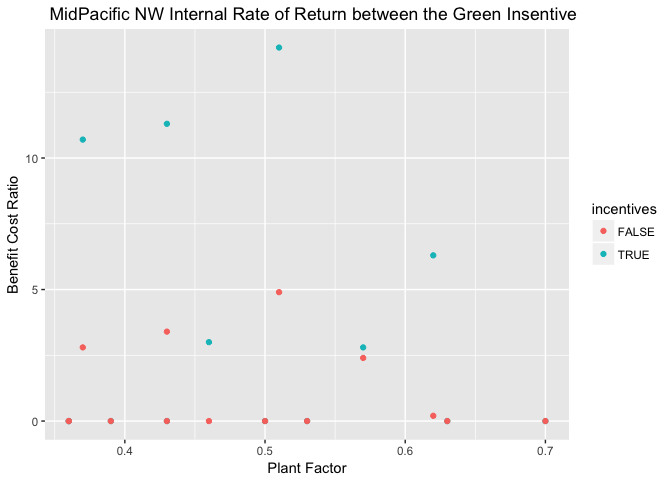

    print(p_greatplains.tidy)

\#Mid-pacific Northwest The Mid-pacific Northwest site contains many
sites that are producing energy at much higher intervals than the energy
needed to run the facility. This can be seen in the green incentive at
the sites also but that the cost ratio is mainly above a 1.0. The
internal rate of return for the green incentives is also much higher
than the data points without the green incentive.

Pacific Northwest Analysis
==========================

The Pacific Northwest region contains 105 sites; only 33 are included in
this data frame from the states Washington, Oregon and most of Idaho.

    ##Pacific Northwest

    tidy_pacificnw <- pacificnw_data[ , gp]

    new_tidy_pacificnw<- gather(tidy_pacificnw, -Plant.Factor, key=incentive_status, value=BCR)
    new_tidy_pacificnw$incentives <- c("Benefit.Cost.Ratio.with.Green.Incentives"=TRUE, "Benefit.Cost.Ratio.without.Green.Incentives")[new_tidy_pacificnw$incentive_status]

    new_tidy_pacificnw$incentives[new_tidy_pacificnw$incentive_status == "Benefit.Cost.Ratio.without.Green.Incentives"] <- FALSE
    new_tidy_pacificnw$incentives[new_tidy_pacificnw$incentive_status == "Benefit.Cost.Ratio.with.Green.Incentives"] <- TRUE

    new_tidy_pacificnw <- melt(tidy_pacificnw, id="Plant.Factor", variable.name="incentives", value.name="BCR")

    p_new_tidy_pacificnw <- ggplot(new_tidy_pacificnw, aes(x=Plant.Factor, y=BCR, color=incentives)) + 
      geom_point() +
      labs(x= "Plant Factor", y="Benefit Cost Ratio", title="Pacific NW Cost Benefit Ratio with and without Green Incentive")

    ##Graph of the plant factor with and without the green incentive. Want to compare the IRR with and without
    #the green incentive.

    r<- c(8, 13, 15)

    irr_pacificnw <- pacificnw_data[ , r]

    irr_pacificnw <- gather(irr_pacificnw, -Plant.Factor, value=IRR, key=incentive_status)
    irr_pacificnw$incentives <- c("IRR.with.Green.Incentives"=TRUE, "IRR.without.Green.Incentives")[irr_pacificnw$incentive_status]

    irr_pacificnw$incentives[irr_pacificnw$incentive_status == "IRR.without.Green.Incentives"] <- FALSE
    irr_pacificnw$incentives[irr_pacificnw$incentive_status == "IRR.with.Green.Incentives"] <- TRUE

    p_pacificnw.irr <- ggplot(irr_pacificnw, aes(x=Plant.Factor, y=IRR, color=incentives)) + 
      geom_point() +
      labs(x= "Plant Factor", y="IRR", title="Internal Rate of Return in the Pacific NW between Green Incentives")

    print(p_pacificnw.irr)

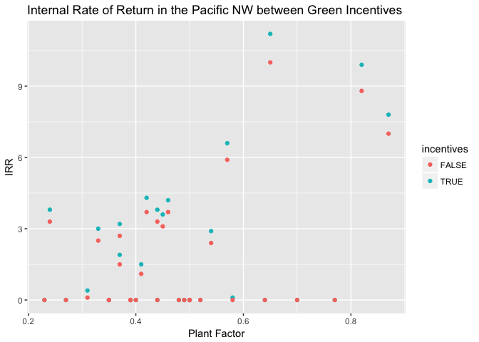

    print(p_new_tidy_pacificnw)

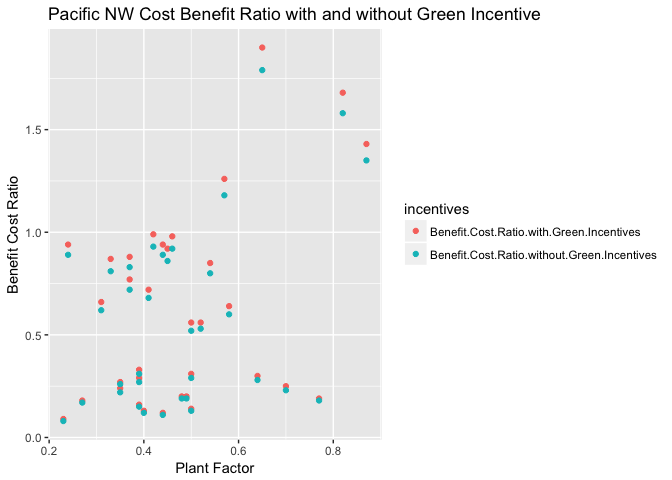
\#Pacific NorthWest Conclusion This region is exhibiting the same trends
as the former regions displayed with the Green incentive being
correlated with a high Benefit Cost ratio, most over 1.0, and a higher
rate of return at each data point.

Upper Colorado Analysis
=======================

The Upper Colorado region is made up of 205 hydropower facilities but
only 64 were included in this open source data frame. The states
included in this region are the remaining portion of Texas, New Mexico,
and Colorado.

    ###Upper Colorado
    tidy_upcolorado_data <- upcolorado_data[ , gp]

    new_tidy_upcolorado_data<- gather(tidy_upcolorado_data, -Plant.Factor, key=incentive_status, value=BCR)
    new_tidy_upcolorado_data$incentives <- c("Benefit.Cost.Ratio.with.Green.Incentives"=TRUE, "Benefit.Cost.Ratio.without.Green.Incentives")[new_tidy_upcolorado_data$incentive_status]

    new_tidy_upcolorado_data$incentives[new_tidy_upcolorado_data$incentive_status == "Benefit.Cost.Ratio.without.Green.Incentives"] <- FALSE
    new_tidy_upcolorado_data$incentives[new_tidy_upcolorado_data$incentive_status == "Benefit.Cost.Ratio.with.Green.Incentives"] <- TRUE

    new_tidy_upcolorado_data <- melt(tidy_greatplains_data, id="Plant.Factor", variable.name="incentives", value.name="BCR")

    p_upcolorado_data<- ggplot(new_tidy_upcolorado_data, aes(x=Plant.Factor, y=BCR, color=incentives)) + 
      geom_point() +
      labs(x= "Plant Factor", y="Benefit Cost Ratio", title="Upper Colorado Cost Benefit ratio comparison in Green Incentive Status")

    ##Graph of the plant factor with and without the green incentive. Want to compare the IRR with and without
    #the green incentive.

    r<- c(8, 13, 15)

    upcolorado_irr <- upcolorado_data[ , r]

    tidy_upcolorado_irr <- gather(upcolorado_irr, -Plant.Factor, value=IRR, key=incentive_status)
    tidy_upcolorado_irr$incentives <- c("IRR.with.Green.Incentives"=TRUE, "IRR.without.Green.Incentives")[tidy_upcolorado_irr$incentive_status]

    tidy_upcolorado_irr$incentives[tidy_upcolorado_irr$incentive_status == "IRR.without.Green.Incentives"] <- FALSE
    tidy_upcolorado_irr$incentives[tidy_upcolorado_irr$incentive_status == "IRR.with.Green.Incentives"] <- TRUE

    p_tidy_upcolorado_irr <- ggplot(tidy_upcolorado_irr, aes(x=Plant.Factor, y=IRR, color=incentives)) + 
      geom_point() +
      labs(x= "Plant Factor", y="IRR", title="Internal rate of return based on Green Incentive in the Upper Colorado Region")

    print(p_tidy_upcolorado_irr)

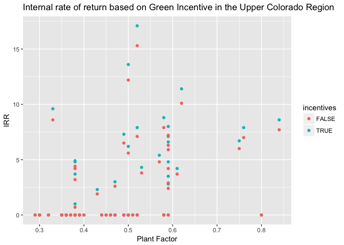

    print(p_upcolorado_data)

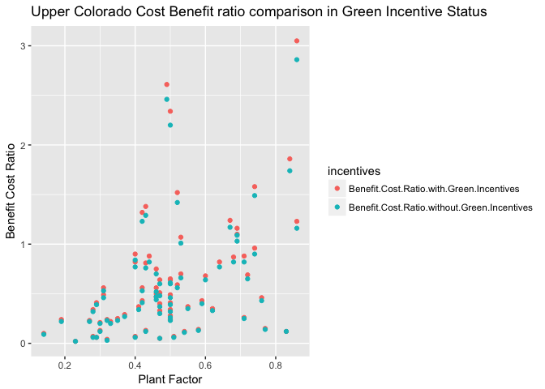
\#Upper Colorado Conclusion The Upper Colorado Region exhibits the same
trends seen in the other regions, but this one has the highest Benefit
Cost Ratio recorded and the highest IRR.

Summary and conclusion
======================

Every region contained Internal Rate of Return and Cost Benefit Ratios
of zeros, but all of these values were without the Green Incentive at
the site. The skimming that I did to read the 344 page executive summary
of the hydropower facility report did not mention which sites did not
receive the green incentive and if the projected values were
theoretical, as they did this study to access long term cost and
production of the sites up to 2060. The data frame also did not include
when the facilities were installed and how long they has been running at
a &gt;1.0 Benefit cost Ratio. This open data frame also did not include
the assumptions that the researches made while collecting data and the
confidence that the researches had during the collection could also skew
actual results. It can be concluded, at face value, that the facilities
that contained the Green Incentive assistant from either the federal or
local government then those facilities are producing more energy than is
necessary to keep the facility operating. Out of all the facilities, the
Great Plains region being the largest span of land may have some weight
in why the data are so multifarious. Likewise, the Upper Colorado region
has some of the highest data points on both variables (IRR and Benefit
Cost Ratio) and is also the largest amount of sites included in this
data frame. It is unclear why the researchers included the total number
of sites in each region in the study but only included a select few in
the open data frame.
